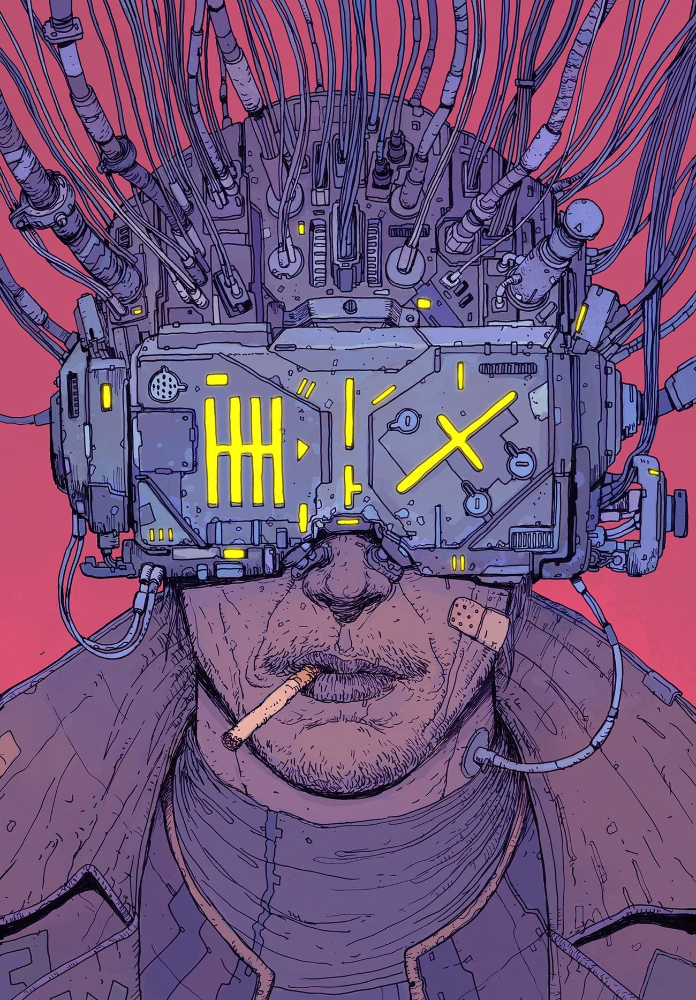

# *`neuromancer`*

> Neuro from the nerves, the silver paths. Romancer. Necromancer. I call up the dead.[^1]

These are my dot files, for the machine that I use to plug into the Matrix[^2]. Feel free to use anything, but beware: don't copy stuff blindly, lest they break your system. For an overview of the packages I install, have a look at [`home/run_once_install.sh`](home/run_once_install.sh).

[^1]: Gibson, William. Neuromancer. ACE, July 1984. p. 243-244.
[^2]: Art (on the right) by [*Jason Gonzalez*](https://www.instagram.com/deathburger).

